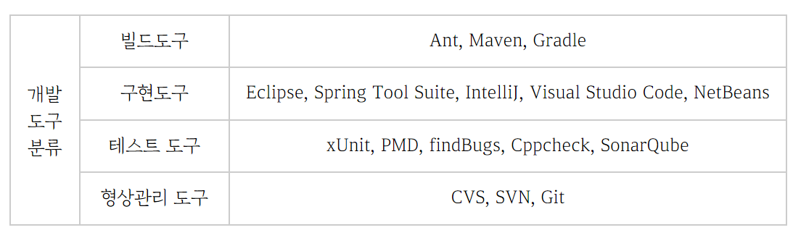
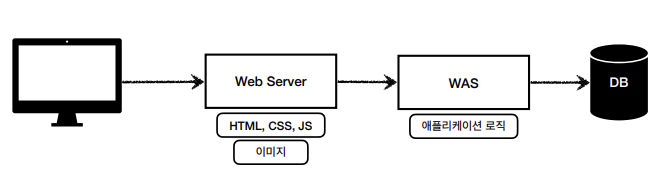
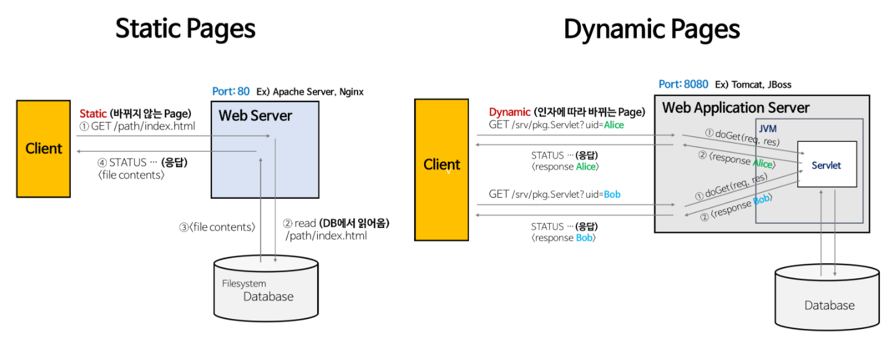
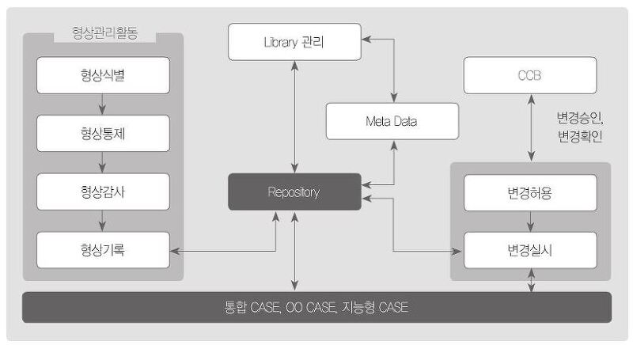
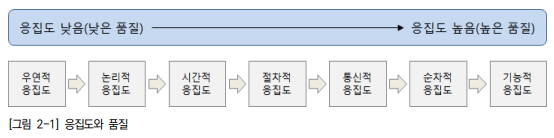
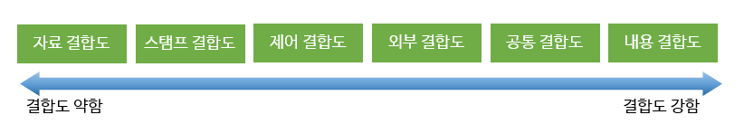

## 서버 프로그램 구현 

### 🌱 개발환경 구축

---

- 개발환경 구축의 개념
  - 개발환경 구성 시 구현될 시스템 요구사항의 명확한 이해가 필요하다.
  - 개발 도구와 서버의 선정이 이루어져야 하고, 개발에 사용되는 도구들의 편의성과 성능, 라이선스를 확인한다.

- 개발도구의 분류

  

| 구분           | 설명                                                         |
| -------------- | ------------------------------------------------------------ |
| 빌드 도구      | - 작성한 코드의 빌드 및 배포를 수행하는 도구 - 각각의 구성요소와 모듈에 대한 의존성 관리를 지원 |
| 구현 도구      | - 개발자의 코드 작성과 디버깅, 수정 등과 같은 작업을 지원하는 도구 - 프로그램을 개발할 때 가장 많이 사용되는 도구 |
| 테스트 도구    | - 코드의 기능 검증과 전체의 품질을 높이기 위해 사용하는 도구 - 코드의 테스트, 테스트에 대한 계획, 수행 및 분석 등의 작업 가능 |
| 형상 관리 도구 | - 개발자들이 작성한 코드와 리소스 등 산출물에 대한 버전 관리를 위한 도구 - 프로젝트 진행 시 필수로 포함 |

- 개발환경 구성요소

  - 하드웨어 개발환경

    - 서버 하드웨어 개발환경

      프로젝트 구성에 따라 웹 서버, 웹 애플리케이션 서버, 데이터베이스 서버, 파일 서버로 구분한다.

      

      | 구분                 | 설명                                                         |
      | -------------------- | ------------------------------------------------------------ |
      | 웹 서버              | - HTTP를 이용한 요청/응답을 처리 - 웹 상의 정적 콘텐츠(CSS, Javascript, Image)를 처리 - WEB-WAS-DB의 3계층 구조를 실무에서 활용 - 주요 제품으로 Apache 웹 서버, IIS 웹 서버, Google Web Server, Nginx  등 존재 |
      | 웹 애플리케이션 서버 | - 동적 콘텐츠(Servelt, JSP)를 처리하기 위해 사용 - 주요 제품으로 Tomcat, Weblogic, Jeus, Resin 등 존재 |

      

      

      

      | 구분              | 설명                                                         |
      | ----------------- | ------------------------------------------------------------ |
      | 데이터베이스 서버 | - 데이터의 수집, 저장을 위한 용도로 사용 - 연계되는 주요 DBMS로 MySQL, Oracle, MS-SQL, DB2 등 존재 |
      | 파일 서버         | - 파일 저장 하드웨어로 물리 저장 장치를 활용한 서버 - 대용량 HDD, SSD 등의 장치가 존재 |

      

- 소프트웨어 개발환경

  - 개발을 위한 기본적인 소프트웨어 개발환경을 선택 및 구성한다.
  - 큰 틀에서 프로젝트 요구사항에 부합한 운영체제, 미들웨어, 데이터베이스 시스템을 선정한다.

  | 구분     | 설명                                                         |
  | -------- | ------------------------------------------------------------ |
  | 운영체제 | - 서버의 하드웨어를 사용자 관점에서 편리하고 유용하게 사용하기 위한 소프트웨어 - 프로젝트의 성격에 따른 운영체제 사용 |
  | 미들웨어 | - 컴퓨터와 컴퓨터 간의 연결을 쉽고 안전하게 할 수 있도록 해주고 이에 대한 관리를 도와주는 소프트웨어 - 자바 기반 환경에서 JVM을 설치하여 컨테이너로의 기능을 주로 이용 |
  | DBMS     | - 사용자와 데이터베이스 사이에서 사용자의 요구에 따라 정보를 생성해주고, 데이터 베이스를 관리해주는 소프트웨어 - 데이터의 저장 및 활용을 위해 DBMS를 설치 |

  

형상 관리(Configuration Management)

- 형상관리의 개념

  형상 관리는 소프트웨어 개발을 위한 전체 과정에서 발생하는 모든 항목의 변경 사항을 관리하기 위한 활동이다.

​		

- 목적

  - 프로젝트 생명주기 동안 제품의 무결성과 변경에 대한 추적성을 확보할 수 있다.
  - 프로젝트 변경이 발생 되었을 때 처리하는 메커니즘을 제공한다.
  - 대표적인 메커니즘으로 형상 관리대상 파악, 베이스라인 지정, 형상 관리, 접근제어 등이 있다.

- 형상 관리의 절차

  - 형상 관리는 다음과 같은 절차를 통해 품질 보증의 목적으로 수행된다.

- | 절차      | 설명                                                         |
  | --------- | ------------------------------------------------------------ |
  | 형상 식별 | - 형상 관리 대상을 정의 및 식별하는 활동 - 추적성 부여를 위해 ID와 관리번호를 부여 - 변경 관련 이슈 발생 시 ID와 관리번호를 이용하여 추적 |
  | 형상 통제 | - 형상 항목의 버전 관리를 위한 형상통제위원회 운영 - 변경요구 관리, 변경제어, 형상 관리 등 통제 지원 - 베이스라인에 대한 관리 및 형상 통제 수행 가능 |
  | 형상 감사 | - 소프트웨어 베이스라인의 무결성 평가 - 베이스라인 변경 시 요구사항과 일치 여부 검토 |
  | 형상 기록 | - 소프트웨어 형상 및 변경관리에 대한 각종 수행결과를 기록 - 형상결과 보고서 작성 |

- 소프트웨어 형상관리 도구 운영

  초기의 소프트웨어 형상 관리 도구는 공유 폴더 방식을 많이 활용하였지만, 최근에는 클라이언트 서버 방식과 분산 저장소 방식이 많이 활용된다.

공통 모듈 구현

재사용

재사용(Reuse)의 개념

- 재사용은 목표 시스템의 개발 시간 및 비용 절감을 위하여 검증된 기능을 파악하고 재구성하여 시스템에 응용하기 위한 최적화 작업이다.
- 재사용은 이미 개발되어 그 기능, 성능 및 품질을 인정받았던 소프트웨어의 전체 또는 일부분을 다시 사용하는 기법이다.

재사용의 종류

- 단위 모듈의 재사용성의 개념이 확장된 재공학, 재개발 기법이 존재한다.

| 구분                   | 설명                                                         |
| ---------------------- | ------------------------------------------------------------ |
| 재공학(Re-Engineering) | - 기존 소프트웨어를 버리지 않고 기능을 개선시키거나 기능을 새로운 소프트웨어로 재활용하는 소프트웨어 재사용 기법 - 재공학의 장점으로는 위험부담 감소, 비용 절감, 개발 기간 단축, 시스템 명세의 오류억제가 있음 |
| 재공학(Re-Development) | - 기존 시스템 내용을 참조하여 완전히 새로운 시스템을 개발, 기존 시스템에 새로운 기능을 추가, 기존 시스템의 기능을 변경하는 기법 |

- 재사용 규모에 따른 분류

  재사용 유형에는 함수/객체 재사용, 컴포넌트 재사용, 애플리케이션 재사용 등이 있다.

  

| 유형                | 설명                                                         |
| ------------------- | ------------------------------------------------------------ |
| 함수와 객체 재사용  | 클래스(Class)나 함수(Function) 단위로 구현한 소스 코드를 재사용 |
| 컴포넌트 재사용     | 컴포넌트 자체에 대한 수정 없이 인터페이스를 통해 통신하는 방식으로 재사용함 |
| 애플리케이션 재사용 | 공통기능을 제공하는 애플리케이션과 기능을 공유하여 재사용    |

공통 모듈 구현의 개념

모듈(Module)의 개념

- 모듈은 그 자체로 하나의 완전한 기능을 수행할 수 있는 독립된 실체이다.
- 모듈화를 통해 분리된 시스템의 각 기능들로 서브프로그램, 서브 루틴, 소프트웨어 내의 단위 프로그램, 작업 단위 등과 같은 의미로 사용된다.

모듈의 특징

- 각각의 모듈은 상대적으로 독립성을 가지고 있다.
- 모듈 내부에는 그 모듈을 하나로 통합하는 수많은 조합이 존재할 수 있다.
- 모듈은 단독으로 컴파일할 수 있으며, 재사용할 수 있다.
- 독립성이 높은 모듈일수록 모듈 수정 시에도 다른 모듈들에는 영향을 거의 미치지 않고, 오류 발생 시에도 쉽게 해결할 수 있다.
- 모듈의 독립성은 결합도와 응집도에 의해 측정되며, 독립성을 높이려면 모듈의 결합도는 약하게(낮게), 응집도는 강하게(높게), 모듈의 크기는 작게 만들어야 한다.

모듈화(Modularization)의 개념 및 기법

- 모듈화는 소프트웨어의 성능을 향상시키거나 복잡한 시스템의 수정, 재사용, 유지 관리 등이 용이하도록 기능 단위의 모듈로 분해하는 설계 및 구현 기법이다.

  | 기법                    | 설명                                                         |
  | ----------------------- | ------------------------------------------------------------ |
  | 루틴(Routine)           | 소프트웨어에서 특정 동작을 수행하는 일련의 코드로 기능을 가진 명령들의 모임 |
  | 메인 루틴(Main Routine) | 프로그램의 주요한 부분이며, 전체의 개략적인 동작 절차를 표시하도록 만들어진 루틴 - 메인 루틴은 서브 루틴을 호출 |
  | 서브 루틴(Subroutine)   | - 메인 루틴에 의해 필요할 때마다 호출되는 루틴               |

- 공통 모듈 구현의 개념
  - 소프트웨어 개발에 있어 기능을 분할하고 추상화하여 성능을 향상시키고 유지보수를 효과적으로 하기위한 공통 컴포넌트 구현 기법이다.
  - 인터페이스 모듈, 데이터베이스 접근 모듈 등 필요한 공통 모듈을 구현한다.
  - 모듈 간의 결합도는 줄이고, 응집도는 높인 공통 모듈 구현을 권장하고 있다.

소프트웨어 모듈 응집도

- 응집도의 개념

  - 응집도는 모듈의 독립성을 나타내는 정도로, 모듈 내부 구성요소 간 연관도이다.
  - 하나의 모듈은 하나의 기능을 수행할수록 응집도가 높다.

-  응집도의 유형

  응집도의 유형에는 우연적, 논리적, 시간적, 절차적, 통신적, 순차적, 기능적 응집도 순서로 응집도가 높아진다.

  | 유형                                   | 설명                                                         |
  | -------------------------------------- | ------------------------------------------------------------ |
  | 우연적 응집도 (Coincidental Cohesion)  | 모듈 내부의 각 구성요소가 연관이 없을 경우의 응집도          |
  | 논리적 응집도 (Logical Cohesion)       | 유사한 성격을 갖거나 특정 형태로 분류되는 처리 요소들이 한 모듈에서 처리되는 경우의 응집도 |
  | 시간적 응집도 (Temporal Cohesion)      | 연관된 기능이라기보다는 특정 시간에 처리되어야 하는 활동들을 한 모듈에서 처리할 경우의 응집도 |
  | 절차적 응집도 (Procedural Cohesion)    | 모듈이 다수의 관련 기능을 가질 때 모듈 안의 구성요소들이 그 기능을 순차적으로 수행할 경우의 응집도 |
  | 통신적 응집도 (Communication Cohesion) | 동일한 입력과 출력을 사용하여 다른 기능을 수행하는 활동들이 모여 있을 경우의 응집도 |
  | 순차적 응집도 (Sequential Cohesion)    | 모듈 내에서 한 활동으로부터 나온 출력값을 다른 활동이 사용할 경우의 응집도 |
  | 기능적 응집도 (Functional Cohesion)    | 모듈 내부의 모든 기능이 단일한 목적을 위해 수행되는 경우의 응집도 |

  

  

결합도(Coupling)의 개념

- 모듈 내부가 아닌 외부의 모듈과의 연관도 또는 모듈 간의 상호의존성이다.
- 소프트웨어 구조에서 모듈 간의 관련성을 측정하는 척도이다.

결합도의 유형

- 결합도의 유형은 내용, 공통, 외부, 제어, 스탬프, 자료 결합도 순으로 결합도가 낮아진다.

| 유형                            | 설명                                                         |
| ------------------------------- | ------------------------------------------------------------ |
| 내용 결합도 (Content Coupling)  | - 다른 모듈 내부에 있는 변수나 기능을 다른 모듈에서 사용하는 겨웅의 결합도 - 하나의 모듈이 직접적으로 다른 모듈의 내용을 참조할 때 두 모듈은 내용저긍로 결합되어 있는 경우의 결합도 |
| 공통 결합도 (Common Coupling)   | - 파라미터가 아닌 모듈 밖에 선언되어 있는 전역 변수를 참조하고 전역 변수를 갱신하는 식으로 상호 작용하는 경우의 결합도  - 공유되는 공통 데이터 영역을 여러 모듈이 사용할 때의 결합도 |
| 외부 결합도 (External Coupling) | - 두 개의 모듈이 외부에서 도입된 데이터 포맷, 통신 프로토콜, 또는 디바이스 인터페이스를 공유할 경우의 결합도 - 외부 모듈에서 선언한 데이터(변수)를 외부의 다른 모듈에서 참조할 때의 결합도 |
| 제어 결합도 (Control Coupling)  | - 어떤 모듈이 다른 모듈의 내부 논ㄴ리 조직을 제어하기 위한 목적으로 제어 신호를 이용하여 통신하는 경우의 결합도 - 하위 모듈에서 상위 모듈로 제어 신호가 이동하여 상위 모듈에게 처리 명령을 부여하는 권리 전도 현상이 발생하는 결합도 |
| 스탬프 결합도 (Stamp Coupling)  | - 모듈 간의 인터페이스로 배열이나 객체, 구조 등이 전달되는 경우의 결합도 - 두 모듈이 동일한 자료 구조를 조회하는 경우의 결합도이며, 자료 구조의 어떠한 변화는 모든 모듈에 영향을 미치게 됨 |
| 자료 결합도 (Data Coupling)     | - 모듈 간의 인터페이스로 전달되는 파라미터를 통해서만 모듈 간의 상호 작용이 일어나는 경우의 결합도 - 한 모듈의 내용을 변경하더라도 다른 모듈에는 영향을 미치지 않는 상태로 가장 바람직한 결합도 |

공통 모듈 구현 대상

- 공통 모듈은 화면 모듈, 화면에서 입력받은 데이터 처리를 위한 서비스 컴포넌트, 비즈니스 트랜잭션 컴포넌트 등이 있다.
- 통합 구현에서 공통 모듈 구현은 상세설계된 공통 모듈, 환경변수를 실제 프로그래밍 언어로 구현한다.

팬인(Fan-In) 및 팬아웃(Fan-Out)

- 소프트웨어의 구성요소인 모듈을 계층적으로 분석하기 위해서 팬인(Fan-in), 팬 아웃(Fan-Out)을 활용한다.
- 팬인과 팬아웃 분석을 통하여 시스템의 복잡도를 측정할 수 있다.

| 구분           | 팬인(Fan-In)                                                 | 팬아웃(Fan-Out)                                              |
| -------------- | ------------------------------------------------------------ | ------------------------------------------------------------ |
| 개념           | 어떤 모듈을 제어(호출)하는 모듈의 수                         | 어떤 모듈에 의해 제어(호출)되는 모듈의 수                    |
| 모듈 숫자 계산 | 모듈 자신을 기준으로 모듈에 들어오면 팬인(in)                | 모듈 자신을 기준으로 모듈에서 나가면 팬아웃(out)             |
| 고려사항       | - 팬인이 높으면 재사용 측면에서 설계가 잘되었지만, 단일 장애점 발생 가능 - 팬인이 높으면 관리 비용 및 테스트 비용 증가 | - 팬아웃이 높을 경우는 불필요한 모듈 호출 여부 검토 필요 - 팬아웃이 높을 경우는 단순화 여부 검토 필요 |

- 시스템 복잡도를 최적화하기 위해서는 팬인은 높게, 팬아웃은 낮게 설계해야 한다.

공통 모듈 테스트의 개념

- 공통 모듈 테스트를 위해 IDE(Integrated Development Environment) 도구를 활용하여 개별 공통 모듈에 대한 디버깅을 수행한다.
- 공통 모듈 테스트는 화이트박스 기법을 활용한다.
- 대표적인 단위 테스트 도구인 xUnit을 활용하여 테스트 코드를 구현한다.

공통 모듈 테스트 종류

- xUnit에는 jUnit, CppUnit, HttpUnit 등이 있다.

  | 종류     | 설명                                                         |
  | -------- | ------------------------------------------------------------ |
  | jUnit    | 자바 프로그래밍 언어용 단위 테스트 도구  - Erich Gamma와 Kent Beck 등이 작성한 오픈소스로 Java 단위 테스트 프레임워크 |
  | CppUnit  | - 자바의 jUnit을 C++로 구현한 단위 테스트 도구               |
  | HttpUnit | - 웹 브라우저 없이 웹사이트 테스트를 수행하는 단위 테스트 도구 |

  
