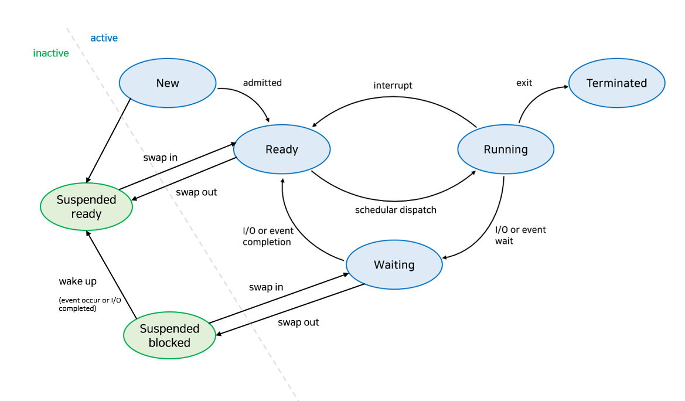
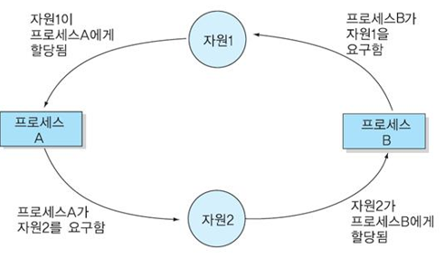

## 운영체제 (OS ; Operating System)

#### 1. 운영체제(OS ; Operating System)의 개념

사용자가 컴퓨터의 하드웨어를 쉽게 사용할 수 있도록 관리 및 운영함으로써 사용자에게 편리성을 제공해 주는 소프트웨어이다.

#### 2. 운영체제의 특징

사용자 편리성 제공, 인터페이스 기능을 담당, 스케줄링 담당, 자원 관리, 제어 기능

#### 3. 커널과 쉘

##### 커널 (Kernel)

---

운영체제의 핵심이 되는 기능들이 모여 있는 컴퓨터 프로그램이다.

컴퓨터가 부팅될 때 주기억 장치에 적재된 후 상주하면서 실행하며, 프로그램과 하드웨어 간의 인터페이스 역할을 담당한다.

기능 : 프로세스 관리, 기억장치 관리, 주변장치 관리, 파일 관리

##### 쉘 (Shell)

---

사용자가 입력시킨 명령어 라인(CLI)을 읽어 필요한 시스템 기능을 실행시키는 명령어 해석기이다.

시스템과 사용자 간의 인터페이스를 제공하며, 여러 가지의 내장 명령어를 가지고 있다.

#### 4. 운영체제 핵심 기능 

운영체제는 중앙처리장치, 메모리, 스토리지, 주변 기기 등을 적절히 관리한다.

- 핵심 기능

  - 메모리 관리

    - 프로그램의 실행이 종료될 때까지 메모리를 가용한 상태로 유지 및 관리하는 기능 
    - 프로그램 실행 중 메모리가 꽉 차게 되면 시스템의 속도가 느려지고 때로는 시스템이 멈추는 현상이 발생
    - 메모리에 있는 프로그램은 CPU로 이동하여 처리(CPU는 가상 주소를, 메모리는 물리 주소를 사용하는데 MMU가 주소를 매핑하는 역할 수행)

    

  - 프로세스 관리

    - 프로세스 관리 기법에는 '일시 중지 및 재실행', '동기화', '통신', '교착상태 처리', '프로세스 생성 삭제'가 있음

---

### ☘️ 메모리관리

##### 메모리 관리 기법

---

| 기법             | 설명                                                         | 세부 기법                                                    |
| ---------------- | ------------------------------------------------------------ | ------------------------------------------------------------ |
| 반입 기법 (When) | 주 기억 장치에 적재할 다음 프로세스의 반입 시기를 결정하는 기법, 메모리로의 적재 시기를 결정 | 요구 반입 기법, 예상 반입 기법                               |
| 배치 기법(Where) | 디스크에 있는 프로세스를 주기억장치의 어느 위치에 저장할 것인지 결정하는 기법, 메모리 적재 위치 결정 | 최초 적합(First-Fit) 최적 적합(Best-Fit) 최악적합(Worst-Fit) |
| 할당 기법(How)   | 실행해야 할 프로세스를 주기억장치에 어떤 방법으로 할당할 것인지 결정하는 기법, 메모리 적재 방법 결정 | 연속 할당 기법, 분산 할당 기법                               |
| 교체 기법(Who)   | 재배치 기법으로 주기억장치에 있는 프로세스 중 어떤 프로세스를 제거할 것인지를 결정하는 기법, 메모리 교체 대상 결정 | 프로세스의 Swap In/Out, FIFO, Optimal, LRU, LFU, 시계 알고리즘, MFU |

##### 메모리 배치 기법

---

| 기법                  | 설명                                                         |
| --------------------- | ------------------------------------------------------------ |
| 최초 적합 (First Fit) | 프로세스가 적재될 수 있는 가용 공간 중에서 첫 번째 분할에 할당하는 방식 |
| 최적 적합 (Best Fit)  | 가용 공간 중에서 가장 크기가 비슷한 공간을 선택하여 프로세스를 적재하는 방식, 공백 최소화 장점이 있다. |
| 최악적합 (Worst Fit)  | 프로세스의 가용 공간 중에서 가장 큰 공간에 할당하는 방식     |

##### 메모리 할당 기법

---

| 종류           | 설명                                                         | 기법                                                         |
| -------------- | ------------------------------------------------------------ | ------------------------------------------------------------ |
| 연속 할당 기법 | 실행을 위한 각 프로세스를 주기억장치 공간 내에서 인접되게 연속하여 저장하는 방법 | - 단일 분할 할당 기법 : 오버레이, 스와핑 - 다중 분할 할당 기법 : 고정 분할 할당 기법, 동적 분할 할당 기법 |
| 분산 할당 기법 | 하나의 프로세스를 여러 개의 조각으로 나누어 주기억장치 공간 내 분산하여 배치하는 기법 | - 페이징 기법 - 세그먼테이션 기법 - 페이징/세그먼테이션 기법 |

- 페이징 기법 

  페이징 기법은 가상기억장치 내의 프로세스를 일정하게 분할하여 주기억장치의 분산된 공간에 적재시킨 후 프로세스를 수행시키는 기법이다.

  

  - 페이징 기법의 문제 및 해결방안

    - 페이징 기법의 문제점 - 스레싱(Thrashing)

      스레싱은 어떤 프로세스가 계속적으로 페이지 부재가 발행하여 프로세스의 실체 처리 시간보다 페이지 교체 시간이 더 많아지는 현상이다. 
      오류율(Miss Rate)이 클수록 스레싱이 많이 발생한 것이고, 스레싱으로 인해 전체 시스템의 성능 및 처리율은 저하된다.

    

    

    

    - 페이징 기법의 문제점 해결방안 - 워킹 세트(Working Set)

      워킹 세트는 각 프로세스가 많이 참조하는 페이지들의 집합을 주기억장치 공간에 계속 상주하게 하여 빈번한 페이지 교체 현상을 줄이고자 하는 기법이다.

      

      

      

    - 페이징 기법의 문제점 해결방안 - 페이지 부재 빈도(PFF; Page-Fault Frequency)

      페이지 부재 빈도는 페이지 부재율의 상한과 하한을 정해서 직접적으로 페이지 부재율을 예측하고 조절하는 기법이며 부재 비율에 따라 페이지 프레임 개수를 조절한다.

      

      

| 장점                                                         | 단점                                                         |
| ------------------------------------------------------------ | ------------------------------------------------------------ |
| 페이지 부재 발생 시 실행하여 부하가 적고, 직접적으로 페이지 부재율 조절이 가능하다. | 프로세스를 중지 시키는 과정이 발생하고, 페이지 참조가 새로운 지역성으로 이동할 수 있다. |

- 세그먼테이션 기법 

  세그먼테이션 기법은 가상기억장치 내의 프로세스를 가변적인 크기의 블록으로 나누고 메모리를 할당하는 기법이다. 
  분할 형태가 배열이나 함수와 같은 논리적인 다양한 크기의 가변적인 크기로 관리한다.

  

##### 교체 기법

---

| 세부 기법                            | 설명                                                         |
| ------------------------------------ | ------------------------------------------------------------ |
| FIFO (First In First Out)       | 각 페이지가 주기억장치에 적재될 때마다 그때의 시간을 기억시켜 가장 먼저 들어와 가장 오래 있던 페이지를 교체하는 기법(선입선출) |
| LRU (Least Recently Used)       | - 사용된 시간을 확인하여 가장 오랫동안 사용되지 않은 페이지를 선택하여 교체하는 기법 - 프로그램의 지역성의 원리에 따라서 최근에 참조된 페이지는 앞으로도 참조될 가능성이 크고, 최근에 참조되지 않은 페이지는 앞으로도 참조되지 않을 가능성이 크다는 전제로 구현된 알고리즘 |
| LFU (Least Frequently Used)     | 사용된 횟수를 확인하여 참조 횟수가 가장 적은 페이지를 선택하여 교체하는 기법 |
| OPT (OPTimal Replacement)       | - 앞으로 가장 오랫동안 사용하지 않을 페이지를 교체하는 기법 - 페이지 부재 횟수가 가장 적게 발생하는 가장 효율적인 알고리즘 |
| NUR (Not Used Recently)         | - 최근에 사용하지 않은 페이지를 교체하는 기법으로 LRU와 비슷한 알고리즘이다. - 최근에 사용되지 않은 페이지는 앞으로도 사용되지 않을 가능성이 크다는 것을 전제로, LRU에서 나타나는 시간적인 오버헤드를 줄일 수 있음 - 최근의 사용 여부를 확인하기 위해서 페이지마다 참조 비트와 변형 비트 사용 |
| SCR (Second Chance Replacement) | 가장 오랫동안 주기억장치에 있던 페이지 중 자주 사용되는 페이지의 교체를 방지하기 위한 기법으로 FIFO 기법의 단점을 보완하는 기법 |

##### 메모리 단편화

---

분할된 주기억장치에 프로세스를 할당, 반납 과정에서 사용되지 못하고 낭비되는 기억장치가 발생하는 현상이다.

| 구분        | 설명                                                         |
| ----------- | ------------------------------------------------------------ |
| 내부 단편화 | 분할된 공간에 프로세스를 적재한 후 남은 공간 고정분할 할당 방식 또는 페이징 기법 사용 시 발생하는 메모리 단편화 **해결방안 :** Slab Allocator, 통합, 압축 |
| 외부 단편화 | 할당된 크기가 프로세스 크기보다 작아서 사용하지 못하는 공간  가변 분할 할당 방식 또는 세그먼테이션 기법 사용 시 발생하는 메모리 단편화 **해결방안 :** 버디 메모리 할당, 통합, 압축 |

* Slab Allocator : 페이지 프레임을 할당받아 공간을 작은 크기로 분할하고(캐시 집합) 메모리 요청 시 작은 크기로 메모리를 할당/해체 하는 동적 메모리 관리 기법이다.

* 버디 메모리 할당 : 요청한 프로세스 크기에 가장 알맞은 크기를 할당하기 위해 메모리를 2n의 크기로 분할하여 메모리를 할당하는 기법

  

##### 지역성

---

프로세스가 실행되는 동안 주기억장치를 참조할 때 일부 페이지만 집중적으로 참조하는 특성이다.

프로세스가 집중적으로 사용하는 페이지를 알아내는 방법의 하나로, 가상기억장치 관리의 이론적인 그거가 되었으며, 스레싱을 방지하기 위한 워킹 셋 이론의 기반이 되었다.

참조 지역성(Locality of Reference)이라고도 불리며, 3가지 유형이 존재한다.

| First Header            | 설명                                                         | 사례                               |
| ----------------------- | ------------------------------------------------------------ | ---------------------------------- |
| 시간(Temporal) 지역성   | 최근 사용되었던 기억장소들이 집중적으로 액세스하는 현상, 참조했던 메모리는 빠른 시간에 다시 참조될 확률이 높은 특성 | Loop, Stack, Sub Routine, Counting |
| 공간(Spatial) 지역성    | 프로세스 실행 시 일정 위치의 페이지를 집중적으로 엑세스하는 현상,  참조된 메모리 근처의 메모리를 참조하는 특성 | 배열 순회                          |
| 순차(Sequential) 지역성 | 데이터가 순차적으로 액세스 되는 현상                         | 순차적 코드 실행                   |

====================================================================================================

### 🍀  프로세스

##### 프로세스

---

프로세스는 CPU에 의해 처리되는 프로그램이다.

실행중인 프로그램을 의미하며, 작업(Job) 또는 태스크(Task)라고도 한다.

| 프로세스 상태     | 설명                                                         |
| ----------------- | ------------------------------------------------------------ |
| Created (생성)    | 사용자에 의해 프로세스가 생성된 상태                         |
| Ready (준비)      | CPU를 할당받을 수 있는 상태 준비 리스트(Ready List) : 각각 우선순위를 부여하여 가장 높은 우선순위를 갖는 프로세스가 다음 순서에 CPU를 할당 받음 |
| Running (실행)    | 프로세스가 CPU를 할당받아 동작 중인 상태                     |
| Wating (대기)     | 프로세스 실행 중 입출력 처리 등으로 인해 CPU를 양도하고 입출력 처리가 완료까지 대기 리스트에서 기다리는 상태 대기 리스트(Waiting List) : 우선순위가 존재하지 않음 |
| Terminated (완료) | 프로세스가 CPU를 할당받아 주어진 시간 내에 완전히 수행을 종료한 상태 |

| 프로세스 상태 전이                              | 설명                                                         |
| ----------------------------------------------- | ------------------------------------------------------------ |
| Dispatch (디스패치)                             | 준비 상태에 있는 여러 프로세스 중 실행될 프로세스를 선정하여 CPU를 할당 -> Context switching (문맥 교환) 발생 프로세스는 준비 상태에서 실행 상태로 전이 |
| Timer run out (타이머 런 아웃 = 할당 시간 초과) | CPU를 할당받은 프로세스는 지정된 시간이 초과되면 스케줄러에 의해 PCB 저장, CPU 반납 후 다시 준비 상태로 전이됨 프로세스는 실행 상태에서 준비 상태로 전이 타임 슬라이스(Time Slice) 만료, 선점(Preemption) 시 타임아웃 발생 |
| Block (블록 = 입출력 발생)                      | 실행 상태에 있는 프로세스가 지정된 할당 시간을 초과하기 전에 입출력이나 기타 사건이 발생(Block)하면 CPU를 스스로 반납하고 입출력이 완료될 때까지 대기 상태로 전이됨 프로세스는 실행 상태에서 대기 상태로 전이 |
| Wake-up (웨이크 업 = 깨움)                      | 어느 순간에 입출력이 종료되면 대기 상태의 프로세스에게 입출력 종료 사실을 wait & signal 등에 의해 알려주고, 준비 상태로 전이됨 프로세스는 대기 상태에서 준비 상태로 전이 |

##### 프로세스 스케줄링

---

프로세스 스케줄링은 CPU를 사용하려고 하는 프로세스들 사이의 우선순위를 관리하는 작업이다.

스케줄링은 처리율과 CPU 이용률을 증가시키고 오버헤드, 응답시간, 반환시간, 대기시간을 최소화시키기 위한 기법이다.

##### 프로세스 스케줄링 유형

---

프로세스 스케줄링 유형에는 선점형 스케줄링과 비선점형 스케줄링이 있다.

| 구분     | 선점형 스케줄링  (Preemptive Scheduling)                | 비선점형 스케줄링 (Non Preemptive Scheduling)           |
| -------- | ------------------------------------------------------------ | ------------------------------------------------------------ |
| 개념     | 하나의 프로세스가 CPU를 차지하고 있을 때, 우선순위가 높은 다른 프로세스가 현재 프로세스를 중단시키고 CPU를 점유하는 스케줄링 방식 | 한 프로세스가 CPU를 할당받으면 작업 종료 후 CPU 반환 시까지 다른 프로세스는 CPU 점유가 불가능한 스케줄링 방식 |
| 장점     | 비교적 빠른 응답 대화식 시분할 시스템에 적합            | 응답시간 예상이 용이 모든 프로세스에 대한 요구를 공정하게 처리 |
| 단점     | 높은 우선순위 프로세스들이 들어오는 경우 오버헤드 초래       | 짧은 작업을 수행하는 프로세스가 긴 작업 종료 시까지 대기     |
| 알고리즘 | - 라운드 로빈 (Round Robin) - SRT (Shortest Remaining Time) - 다단계 큐 (Multi - Level Queue) - 다단계 피드백 큐 (Multi-Level Feedback Queue) | - 우선순위 - 기한부 - FCFS - HRN - SJF(Shortest Job First) |
| 활용     | 실시간 응답 환경, Deadline 응답 환경                         | 처리시간 편차가 적은 특정 프로세스 환경                      |

##### 프로세스 스케줄링 알고리즘

---

- 선점형 스케줄링 알고리즘

| 알고리즘 유형                                 | 동작 방식                                                    | 특징                                                         |
| --------------------------------------------- | ------------------------------------------------------------ | ------------------------------------------------------------ |
| 라운드 로빈(RR ; Round Robin)                 | 프로세스는 같은 크기의 CPU 시간을 할당(시간 할당량), 프로세스가 할당된 시간 내에 처리 완료를 못하면 준비 큐 리스트의 가장 뒤로 보내지고, CPU는 대기 중인 다음 프로세스로 넘어가는 스케줄링 기법 | 균등한 CPU 점유시간 시분할 시스템을 이용                |
| SRT (Shortest Remaining Time First)           | 가장 짧은 시간이 소요되는 프로세스를 먼저 수행한다. 남은 처리시간이 더 짧다고 판단되는 프로세스가 준비 큐에 생기면 언제라도 프로세스가 선점되는 스케줄링 기법 | 짧은 수행 시간 프로세스를 우선 수행                          |
| 다단계 큐 (MLQ ; Multi Level Queue)           | 작업들을 여러 종류 그룹으로 분할, 여러 개의 큐를 이용하여 상위단계 작업에 의한 하위단계 작업이 선점 당하는 스케줄링 기법 | 독립된 스케줄링 큐                                           |
| 다단계 큐 (MLFQ ; Multi Level Feedback Queue) | FCFS(FIFO)와 라운드 로빈 스케줄링 기법을 혼합한 것으로, 새로운 프로세스는 높은 우선순위, 프로세스의 실행시간이 길어질수록 점점 낮은 우선순위 큐로 이동하고 마지막 단계는 라운드 로빈 방식을 적요하는 스케줄링 기법 | 큐마다 다른 시간 할당량 마지막 단계는 라운드 로빈 방식 처리 |

- 비선점형 스케줄링 알고리즘

| 알고리즘 유형                    | 동작 방식                                                    | 특징                                                         |
| -------------------------------- | ------------------------------------------------------------ | ------------------------------------------------------------ |
| 우선순위(Priority)               | 프로세스별로 우선순위가 주어지고, 우선순위에 따라 CPU를 할당하는 스케줄링 기법 동일 순위는 FCFS | 주요 / 긴급 프로세스에 대한 우선 처리 설정, 자원 상황 등에 따른 우선순위 선정 |
| 기한부(Deadline)                 | 작업들이 명시된 시간이나 기한 내에 완료되도록 계획하는 스케줄링 기법 | 요청에 명시된 시간 내 처리를 보장                            |
| FCFS(First Come First Service)   | 프로세스가 대기 큐에 도착한 순서에 따라 CPU를 할당하는 스케줄링 기법 FIFO 알고리즘이라고도 함 | 도착한 순서대로 처리                                         |
| SJF(Shortest Job First)          | 프로세스가 도착하는 시점에 따라 그 당시 가장 작은 서비스 시간을 갖는 프로세스가 종료 시까지 자원을 점유하는 스케줄링 기법 준비 큐 작업 중 가장 짧은 작업부터 수행, 평균 대기시간 최소 CPU 요구 시간이 긴 작업과 짧은 작업 간의 불평등이 심하여, CPU 요구 시간이 긴 프로세스는 기아 현상 발생 | 기아 현상 발생 가능성                                        |
| HRN(Highest Response Ratio Next) | 대기중인 프로세스 중 현재 응답률(Response Ratio)이 가장 높은 것을 선택하는 스케줄링 기법 SJF의 약점인 기아 현상을 보완한 기법으로 긴 작업과 짧은 작업 간의 불평등 완화 | 기아 현상 최소화 기법                                   |

====================================================================================================

#### 🍒 프로세스 관리 - 교착상태 (DeadLock)

---

- 개념

  교착상태는 다중프로세싱 환경에서 두 개 이상의 프로세스가 특정 자원할당을 무한정 대기하는 상태이다.

- 발생 조건 

  상호 배제, 점유와 대기, 비선점, 환형 대기가 있다.

  

| 발생 조건                    | 설명                                                         |
| ---------------------------- | ------------------------------------------------------------ |
| 상호 배제 (Mutual Exclusive) | 프로세스가 자원을 배타적으로 점유하여 다른 프로세스가 그 자원을 사용할 수 없는 상태 |
| 점유와 대기 (Hold & Wait)    | 한 프로세스가 자원을 점유하고 있으면서 또 다른 자원을 요청하여 대기하고 있는 상태 |
| 비선점 (Non Preemption)      | 한 프로세스가 점유한 자원에 대해 다른 프로세스가 선점할 수 없고, 오직 점유한 프로세스만이 해제 가능한 상태 |
| 환영 대기 (Circular Wait)    | 두 개 이상의 프로세스 간 자원의 점유와 대기가 하나의 원형을 구성한 상태 |

- 해결방법

| 해결 방법         | 설명                                                         | 세부 기법                             |
| ----------------- | ------------------------------------------------------------ | ------------------------------------- |
| 예방 (Prevention) | 상호 배제를 제외한 나머지 교착상태 발생조선을 위배(부정)하는 방안 | 점유 자원 해제 후 새 자원 요청        |
| 회피 (Avoidance)  | 안전한 상태를 유지할 수 있는 요구만 수락                     | 은행가 알고리즘, Wound-Wait, Wait-Die |
| 발견 (Detection)  | 시스템의 상태를 감시 알고리즘 통해 교착 상태 검사            | 자원할당 그래프, Wait for Graph       |
| 복구 (Recovery)   | 교착상태가 없어질 때까지 프로세스를 순차적으로 Kill하여 제거, 희생자 선택해야 하고 기아 상태 발생 | 프로세스 Kill, 자원선점               |

**은행가 알고리즘 (Banker's Algorithm)*

사용자 프로세스는 사전에 자기 작업에 필요한 자원의 수를 제시하고 운영체제가 자원의 상태를 감시, 안정상태일 때만 자원을 할당하는 교착상태 회피기법이다.

---

