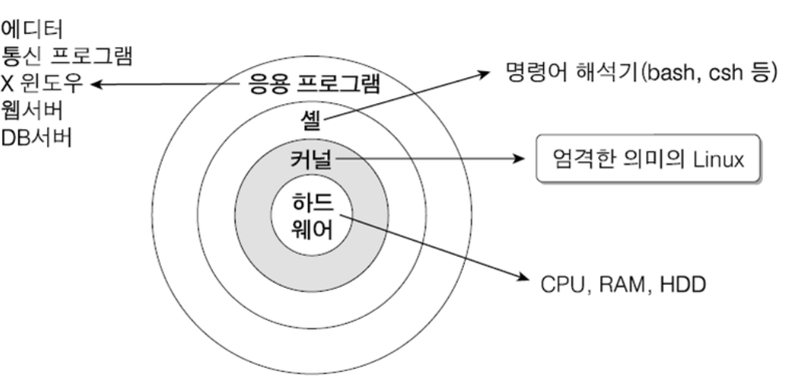
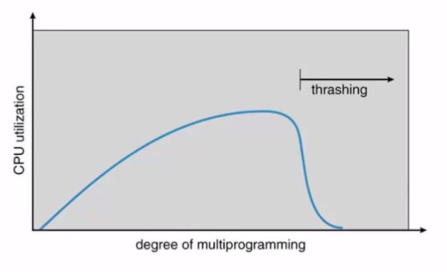
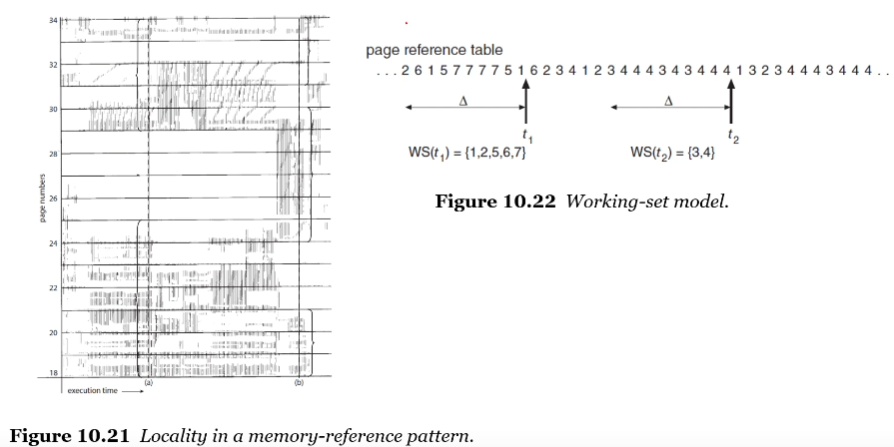
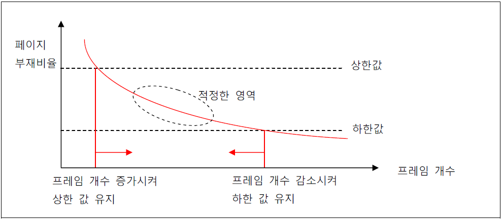
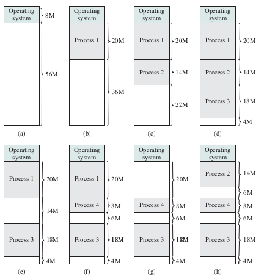
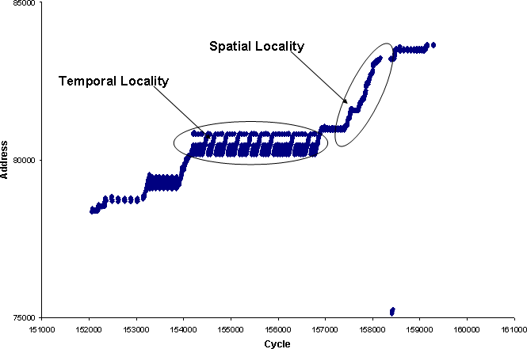
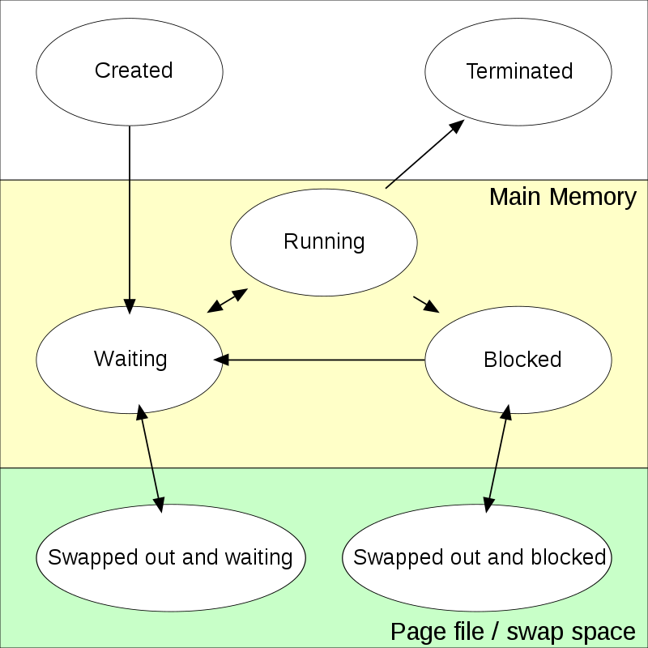
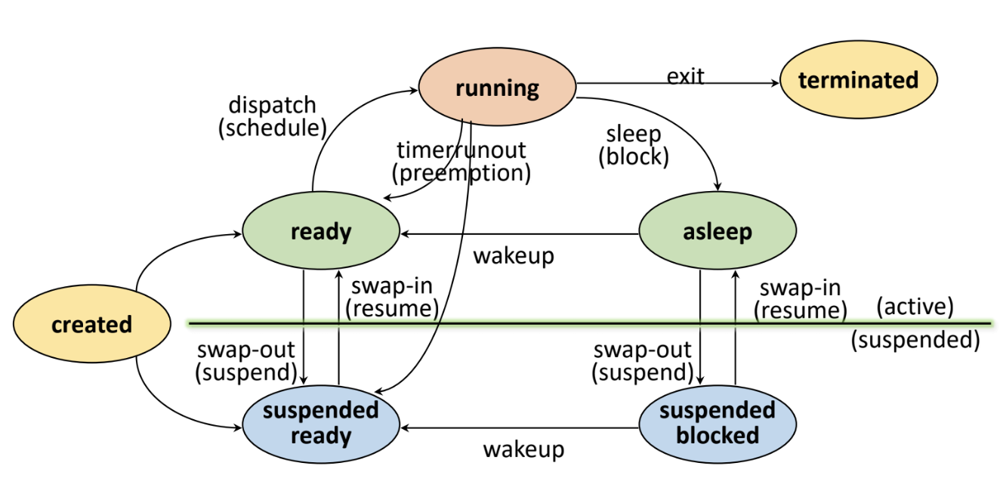

## 🌿 운영체제

#### 1. 운영체제(OS ; Operating System)의 개념

사용자가 컴퓨터의 하드웨어를 쉽게 사용할 수 있도록 관리 및 운영함으로써 사용자에게 편리성을 제공해 주는 소프트웨어이다.

#### 2. 운영체제의 특징

사용자 편리성 제공, 인터페이스 기능을 담당, 스케줄링 담당, 자원 관리, 제어 기능

#### 3. 커널과 쉘

##### 커널 (Kernel)

---

운영체제의 핵심이 되는 기능들이 모여 있는 컴퓨터 프로그램이다.

컴퓨터가 부팅될 때 주기억 장치에 적재된 후 상주하면서 실행하며, 프로그램과 하드웨어 간의 인터페이스 역할을 담당한다.

기능 : 프로세스 관리, 기억장치 관리, 주변장치 관리, 파일 관리

##### 쉘 (Shell)

---

사용자가 입력시킨 명령어 라인(CLI)을 읽어 필요한 시스템 기능을 실행시키는 명령어 해석기이다.

시스템과 사용자 간의 인터페이스를 제공하며, 여러 가지의 내장 명령어를 가지고 있다.

#### 4. 운영체제 핵심 기능 

운영체제는 중앙처리장치, 메모리, 스토리지, 주변 기기 등을 적절히 관리한다.

핵심 기능 : 메모리관리, 프로세스 관리

#### 5. 메모리관리

##### 메모리 관리 기법

---

| 기법             | 설명                                                         | 세부 기법                                                    |
| ---------------- | ------------------------------------------------------------ | ------------------------------------------------------------ |
| 반입 기법 (When) | 주 기억 장치에 적재할 다음 프로세스의 반입 시기를 결정하는 기법, 메모리로의 적재 시기를 결정 | 요구 반입 기법, 예상 반입 기법                               |
| 배치 기법(Where) | 디스크에 있는 프로세스를 주기억장치의 어느 위치에 저장할 것인지 결정하는 기법, 메모리 적재 위치 결정 | 최초 적합(First-Fit) 최적 적합(Best-Fit) 최악적합(Worst-Fit) |
| 할당 기법(How)   | 실행해야 할 프로세스를 주기억장치에 어떤 방법으로 할당할 것인지 결정하는 기법, 메모리 적재 방법 결정 | 연속 할당 기법, 분산 할당 기법                               |
| 교체 기법(Who)   | 재배치 기법으로 주기억장치에 있는 프로세스 중 어떤 프로세스를 제거할 것인지를 결정하는 기법, 메모리 교체 대상 결정 | 프로세스의 Swap In/Out, FIFO, Optimal, LRU, LFU, 시계 알고리즘, MFU |

##### 메모리 배치 기법

---

| 기법                  | 설명                                                         |
| --------------------- | ------------------------------------------------------------ |
| 최초 적합 (First Fit) | 프로세스가 적재될 수 있는 가용 공간 중에서 첫 번째 분할에 할당하는 방식 |
| 최적 적합 (Best Fit)  | 가용 공간 중에서 가장 크기가 비슷한 공간을 선택하여 프로세스를 적재하는 방식, 공백 최소화 장점이 있다. |
| 최악적합 (Worst Fit)  | 프로세스의 가용 공간 중에서 가장 큰 공간에 할당하는 방식     |

##### 메모리 할당 기법

---

| 종류           | 설명                                                         | 기법                                                         |
| -------------- | ------------------------------------------------------------ | ------------------------------------------------------------ |
| 연속 할당 기법 | 실행을 위한 각 프로세스를 주기억장치 공간 내에서 인접되게 연속하여 저장하는 방법 | 단일 분할 할당 기법 : 오버레이, 스와핑  다중 분할 할당 기법 : 고정 분할 할당 기법, 동적 분할 할당 기법 |
| 분산 할당 기법 | 하나의 프로세스를 여러 개의 조각으로 나누어 주기억장치 공간 내 분산하여 배치하는 기법 | 페이징 기법, 세그먼테이션 기법, 페이징/세그먼테이션 기법     |

페이징 기법 : 페이징 기법은 가상기억장치 내의 프로세스를 일정하게 분할하여 주기억장치의 분산된 공간에 적재시킨 후 프로세스를 수행시키는 기법이다.

페이징 기법의 문제 및 해결방안

페이징 기법의 문제점 - 스레싱(Thrashing)

스레싱은 어떤 프로세스가 계속적으로 페이지 부재가 발행하여 프로세스의 실체 처리 시간보다 페이지 교체 시간이 더 많아지는 현상이다. 오류율(Miss Rate)이 클수록 스레싱이 많이 발생한 것이고, 스레싱으로 인해 전체 시스템의 성능 및 처리율은 저하된다.

페이징 기법의 문제점 해결방안 - 워킹 세트(Working Set)

워킹 세트는 각 프로세스가 많이 참조하는 페이지들의 집합을 주기억장치 공간에 계속 상주하게 하여 빈번한 페이지 교체 현상을 줄이고자 하는 기법이다.

페이징 기법의 문제점 해결방안 - 페이지 부재 빈도(PFF; Page-Fault Frequency)

페이지 부재 빈도는 페이지 부재율의 상한과 하한을 정해서 직접적으로 페이지 부재율을 예측하고 조절하는 기법이며 부재 비율에 따라 페이지 프레임 개수를 조절한다.

| 장점                                                         | 단점                                                         |
| ------------------------------------------------------------ | ------------------------------------------------------------ |
| 페이지 부재 발생 시 실행하여 부하가 적고, 직접적으로 페이지 부재율 조절이 가능하다. | 프로세스를 중지 시키는 과정이 발생하고, 페이지 참조가 새로운 지역성으로 이동할 수 있다. |

세그먼테이션 기법 : 세그먼테이션 기법은 가상기억장치 내의 프로세스를 가변적인 크기의 블록으로 나누고 메모리를 할당하는 기법이다. 분할 형태가 배열이나 함수와 같은 논리적인 다양한 크기의 가변적인 크기로 관리한다.

##### 교체 기법

---

| 세부 기법                            | 설명                                                         |
| ------------------------------------ | ------------------------------------------------------------ |
| FIFO (First In First Out)       | 각 페이지가 주기억장치에 적재될 때마다 그때의 시간을 기억시켜 가장 먼저 들어와 가장 오래 있던 페이지를 교체하는 기법(선입선출) |
| LRU (Least Recently Used)       | 사용된 시간을 확인하여 가장 오랫동안 사용되지 않은 페이지를 선택하여 교체하는 기법 |
| LFU (Least Frequently Used)     | 사용된 횟수를 확인하여 참조 횟수가 가장 적은 페이지를 선택하여 교체하는 기법 |
| OPT (OPTimal Replacement)       | 앞으로 가장 오랫동안 사용하지 않을 페이지를 교체하는 기법    |
| NUR (Not Used Recently)         | 최근에 사용하지 않은 페이지를 교체하는 기법으로 LRU와 비슷한 알고리즘이다. |
| SCR (Second Chance Replacement) | 가장 오랫동안 주기억장치에 있던 페이지 중 자주 사용되는 페이지의 교체를 방지하기 위한 기법으로 FIFO 기법의 단점을 보완하는 기법 |

##### 메모리 단편화

---

분할된 주기억장치에 프로세스를 할당, 반납 과정에서 사용되지 못하고 낭비되는 기억장치가 발생하는 현상이다.

| 구분        | 설명                                                         |
| ----------- | ------------------------------------------------------------ |
| 내부 단편화 | 분할된 공간에 프로세스를 적재한 후 남은 공간 고정분할 할당 방식 또는 페이징 기법 사용 시 발생하는 메모리 단편화 **해결방안 :** Slab Allocator, 통합, 압축 |
| 외부 단편화 | 할당된 크기가 프로세스 크기보다 작아서 사용하지 못하는 공간  가변 분할 할당 방식 또는 세그먼테이션 기법 사용 시 발생하는 메모리 단편화 **해결방안 :** 버디 메모리 할당, 통합, 압축 |

* Slab Allocator : 페이지 프레임을 할당받아 공간을 작은 크기로 분할하고(캐시 집합) 메모리 요청 시 작은 크기로 메모리를 할당/해체 하는 동적 메모리 관리 기법이다.

* 버디 메모리 할당 : 요청한 프로세스 크기에 가장 알맞은 크기를 할당하기 위해 메모리를 2n의 크기로 분할하여 메모리를 할당하는 기법

##### 지역성

---

프로세스가 실행되는 동안 주기억장치를 참조할 때 일부 페이지만 집중적으로 참조하는 특성이다.

프로세스가 집중적으로 사용하는 페이지를 알아내는 방법의 하나로, 가상기억장치 관리의 이론적인 그거가 되었으며, 스레싱을 방지하기 위한 워킹 셋 이론의 기반이 되었다.

참조 지역성(Locality of Reference)이라고도 불리며, 3가지 유형이 존재한다.

| First Header            | 설명                                                         | 사례                               |
| ----------------------- | ------------------------------------------------------------ | ---------------------------------- |
| 시간(Temporal) 지역성   | 최근 사용되었던 기억장소들이 집중적으로 액세스하는 현상, 참조했던 메모리는 빠른 시간에 다시 참조될 확률이 높은 특성 | Loop, Stack, Sub Routine, Counting |
| 공간(Spatial) 지역성    | 프로세스 실행 시 일정 위치의 페이지를 집중적으로 엑세스하는 현상,  참조된 메모리 근처의 메모리를 참조하는 특성 | 배열 순회                          |
| 순차(Sequential) 지역성 | 데이터가 순차적으로 액세스 되는 현상                         | 순차적 코드 실행                   |

===========================================================

#### 6. 프로세스

##### 프로세스

---

프로세스는 CPU에 의해 처리되는 프로그램이다.

실행중인 프로그램을 의미하며, 작업(Job) 또는 태스크(Task)라고도 한다.

| 프로세스 상태     | 설명                                                         |
| ----------------- | ------------------------------------------------------------ |
| Created (생성)    | 사용자에 의해 프로세스가 생성된 상태                         |
| Ready (준비)      | CPU를 할당받을 수 있는 상태 준비 리스트(Ready List) : 각각 우선순위를 부여하여 가장 높은 우선순위를 갖는 프로세스가 다음 순서에 CPU를 할당 받음 |
| Running (실행)    | 프로세스가 CPU를 할당받아 동작 중인 상태                     |
| Wating (대기)     | 프로세스 실행 중 입출력 처리 등으로 인해 CPU를 양도하고 입출력 처리가 완료까지 대기 리스트에서 기다리는 상태 대기 리스트(Waiting List) : 우선순위가 존재하지 않음 |
| Terminated (완료) | 프로세스가 CPU를 할당받아 주어진 시간 내에 완전히 수행을 종료한 상태 |

| 프로세스 상태 전이                              | 설명                                                         |
| ----------------------------------------------- | ------------------------------------------------------------ |
| Dispatch (디스패치)                             | 준비 상태에 있는 여러 프로세스 중 실행될 프로세스를 선정하여 CPU를 할당 -> Context switching (문맥 교환) 발생 프로세스는 준비 상태에서 실행 상태로 전이 |
| Timer run out (타이머 런 아웃 = 할당 시간 초과) | CPU를 할당받은 프로세스는 지정된 시간이 초과되면 스케줄러에 의해 PCB 저장, CPU 반납 후 다시 준비 상태로 전이됨 프로세스는 실행 상태에서 준비 상태로 전이 타임 슬라이스(Time Slice) 만료, 선점(Preemption) 시 타임아웃 발생 |
| Block (블록 = 입출력 발생)                      | 실행 상태에 있는 프로세스가 지정된 할당 시간을 초과하기 전에 입출력이나 기타 사건이 발생(Block)하면 CPU를 스스로 반납하고 입출력이 완료될 때까지 대기 상태로 전이됨 프로세스는 실행 상태에서 대기 상태로 전이 |
| Wake-up (웨이크 업 = 깨움)                      | 어느 순간에 입출력이 종료되면 대기 상태의 프로세스에게 입출력 종료 사실을 wait & signal 등에 의해 알려주고, 준비 상태로 전이됨 프로세스는 대기 상태에서 준비 상태로 전이 |

