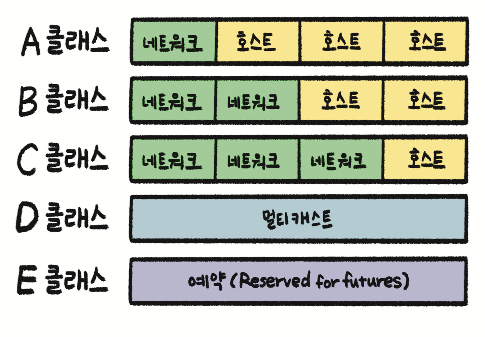
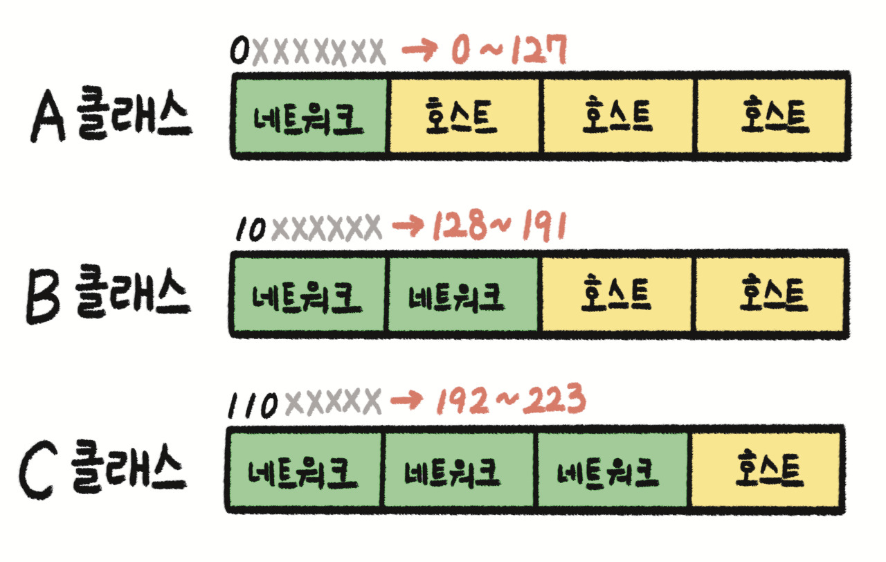
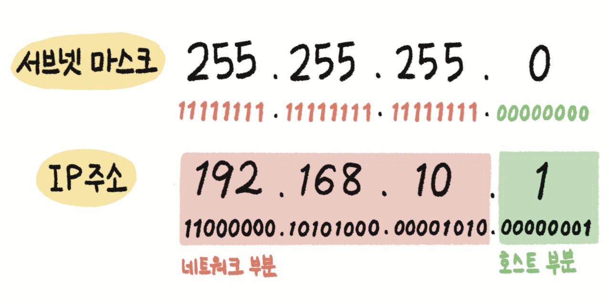
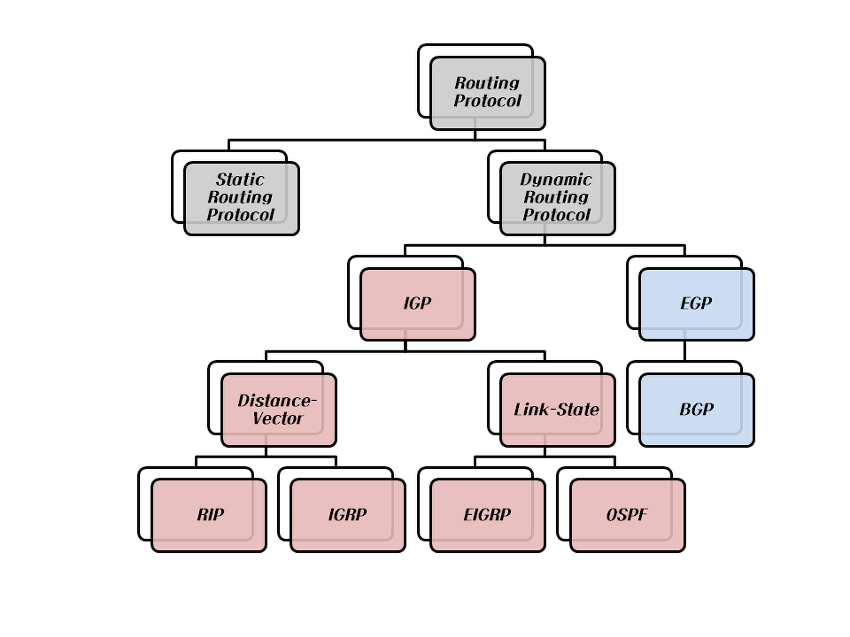

## 네트워크 (Network) 

### 🌱 네트워크 개념

---

원하는 정보를 원하는 수신자 또는 기기에 정확하게 전송하기 위한 기반 인프라이다.

| 분류 | 개념            | 설명                                                         |
| ---- | --------------- | ------------------------------------------------------------ |
| WAN  | 광대역 네트워크 | - LAN에 비해 전송 거리가 넓음, 라우팅 알고리즘이 필요 - LAN 대비 에러율이 높고 전송 지연이 큼 |
| LAN  | 근거리 네트워크 | 한 건물 또는 작은 지역을 커버하는 네트워크임                 |

### 🌿 OSI (Open System Interconnection) 7계층

---

- OSI 7계층은 국제 표준화 기구인 ISO (International Standardization Organization)에서 개발한 **컴퓨터 네트워크 프로토콜 디자인** 과 **통신**을 계층으로 나누어 설명한 개방형 시스템 상호 연결 모델이다.

#### ☘️ 통신망

---

- 근거리 통신망 (LAN ; Local Area Network)

  근거리 통신망은 네트워크 매체를 이용하여 집, 사무실, 학교 등의 건물과 같은 가까운 지역을 한데 묶는 컴퓨터 네트워크이다.

  | 구분             | 설명                                                         |
  | ---------------- | ------------------------------------------------------------ |
  | 전송 매체        | - 동축 케이블 - 광섬유 케이블 - 평형 케이블 - UTP (Unshielded Twisted Pair) - 광 케이블(Optical Cable) |
  | 전송 방식        | - 기저 대역 (Baseband) 방식 - 광대역 (Broadband) 방식   |
  | 전송망 구성 형태 | - 버스형(Bus), 트리형(Tree), 링형(Ring), 성형(Star)          |

- 무선랜 통신망(WLAN; Wireless Local Area Network)

  - 무선랜 통신망은 유선 LAN과 무선 단말 사이를 무선 주파수를 이용하여 전송하는 네트워크이다.

  - IEEE 802.11은 흔히 무선랜, 와이파이(Wi - Fi)라고 부르는 무선 근거리 통신망(Local Area Network)을 위한 컴퓨터 무선 네트워크에 사용되는 기술로, IEEE의 LAN/MAN 표준위원회(IEEE 802)의 11번째 워킹 그룹에서 개발된 표준기술이다.

    | 표준    | 설명                                                         |
    | ------- | ------------------------------------------------------------ |
    | 802.11a | 5GHz 대역에서 54Mbps 속도를 제공                             |
    | 802.11b | 2.4GHz 대역에서 11Mbps 속도를 제공                           |
    | 802.11e | - QoS 강화를 위해 MAC 지원 기능을 채택 - 초고속 서비스(IP 전화, 비디오)에 QoS를 제공 |
    | 802.11f | AP 간의 로밍 기능을 향상시킨 표준                            |

- 원거리 통신망 (WAN; Wide Area Network)

  - WAN은 국가망 또는 각 국가의 공중통신망을 상호 접속시키는 국제정보통신망으로 설계 및 구축, 운용되는 네트워크이다.

  - WAN은 공중통신망 사업자가 구축하고, 일반 대중 가입자들에게 보편적인 정보통신 서비스를 제공한다.

  - 거리에 제약이 없으나 다양한 경로를 지나 정보가 전달되므로 LAN보다 속도가 느리고 에러율도 높다.

  - 원거리 통신망 연결 기술에는 전용회선방식, 회선 교환 방식, 패킷 교환 방식이 있다.

    

  | 연결 기술                          | 설명                                                         |
  | ---------------------------------- | ------------------------------------------------------------ |
  | 전용 회선 방식 (Dedicated Line)    | - 전용 회선 방식은 통신 사업자가 사전에 계약을 체결한 송신자와 수신자끼리만 데이터를 교환하는 방식 - 점대점 프로토콜(PPP), HDLC, SDLC, HNAS 프로토콜에 쓰임 |
  | 회선 교환 방식 (Circuit Switching) | - 물리적 전용선을 활용하여 데이터 전달 경로가 정해진 후 동일 경로로만 전달되는 방식 - 데이터를 통시에 전송할 수 있는 양을 의미하는 대역폭이 고정되고 안정적인 전송률을 확보할 수 있음 |
  | 패킷 교환 방식 (Packet Switching)  | 전체 메시지를 각 노드가 수용할 수 있는 크기(패킷)로 잘라서 보내는 방식 |

- 전송 매체 접속 제어(MAC; Media Access Control)

  - 통신망 사용 시 공유 매체에 대한 다중 접근제어가 중요하다.
  - 전송매체 접속제어 방법에는 CSMA/CD와 CSMA/CA가 있다.

  | 구분                                                         | 설명                                                         |
  | ------------------------------------------------------------ | ------------------------------------------------------------ |
  | CSMA/CD (Carrier Sense Multiple Access with Collision Detection; 반송파 감지 다중 접속 / 충돌 탐지) | IEEE 802.3 유선 LAN의 반이중 방식 (Half Duplex)에서 사용하는 방식으로 각 단말이 신호 전송 전에 현재 채널이 사용 중인지 체크하여 사용하지 않을 때 전송하는 전송매체 접속제어(MAC) 방식 |
  | CSMA/CA (Carrier Sense Multiple Access with Collision Avoidance; 반송파 감지 다중 접속 / 충돌 회피) | IEEE 802.11 무선 LAN의 반이중 방식 (Half Duplex)에서 사용하는 방식으로 데이터 전송 시, 매체가 비어있음을 확인한 뒤 충돌을 피하기 위해서 임의 시간을 기다린 후 데이터를 전송하는 방법 |

#### 🍀 네트워크 장비

---

- 1계층 장비

  | 장비              | 설명                                                         |
  | ----------------- | ------------------------------------------------------------ |
  | 허브 (Hub)        | 여러 대의 컴퓨터를 연결하여 네트워크로 보내거나, 하나의 네트워크로 수신된 정보를 여러 대의 컴퓨터로 송신하기 위한 장비 |
  | 리피터 (Repeater) | 디지털 신호를 증폭시켜 주는 역할을 하여 신호가 약해지지 않고 컴퓨터로 수신되도록 하는 장비 |

- 2계층 장비

  | 장비                         | 설명                                                         |
  | ---------------------------- | ------------------------------------------------------------ |
  | 브리지 (Bridge)              | 두 개의 근거리통신망(LAN)을 서로 연결해 주는 통신망 연결 장치 |
  | L2 스위 (L2 Switch)          | - 느린 전송속도의 브리지, 허브의 단점을 개선하기 위해서, 출발지에서 들어온 프레임(Frame)을 목적지 MAC 주소 기반으로 빠르게 전송시키는 데이터 링크 계층의 통신 장치 |
  | NIC (Network Interface Card) | 외부 네트워크와 접속하여 가장 빠른 속도로 데이터를 주고받을 수 있게 컴퓨터 내에 설치되는 장치 |
  | 스위칭 허브 (Switching Hub)  | - 스위치 기능을 가진 허브 - 사용되는 대부분의 허브가 스위칭 허브 |

- 3계층 장비

  | 장비                  | 설명                                                         |
  | --------------------- | ------------------------------------------------------------ |
  | 라우터 (Router)       | - LAN과 LAN을 연결하거나 LAN과 WAN을 연결하기 위한 인터넷 네트워킹 장비 - 패킷의 위치를 추출하여, 그 위치에 대한 최적의 경로를 지정하며, 이 경로를 따라 데이터 패킷을 다음 장치로 전송시키는 장비 - 라우팅 프로토콜은 경로 설정을 하여 원하는 목적지까지 지정된 데이터가 안전하게 전달되도록 함 |
  | 게이트웨이 (Gateway)  | - 프로토콜을 서로 다른 통신망에 접속할 수 있게 해주는 장치 - LAN에서 다른 네트워크에 데이터를 보내거나 다른 네트워크로부터 데이터를 받아들이는 출입구 역할 |
  | L3 스위치 (L3 Switch) | - 3계층에서 네트워크 단위들을 연결하는 통신 장비 - IP 레이어에서의 스위칭을 수행하여 외부로 전송 |
  | 유무선 인터넷 공유기  | 외부로부터 들어오는 인터넷 라인을 연결하여 유선으로 여러 대의 기계를 연결하거나 무선 신호로 송출하면서 여러 대의 컴퓨터가 하나의 인터넷 라인을 공유할 수 있도록 하는 네트워크 장비 |
  | 망(백본) 스위칭 허브  | - 광역 네트워크를 커버하는 스위칭 허브                       |

  

- 4계층 장비

  | 장비                  | 스위치                                                       |
  | --------------------- | ------------------------------------------------------------ |
  | L4 스위치 (L4 Switch) | - 4계층에서 네트워크 단위들을 연결하는 통신 장비 - TCP / UDP 등 스위칭 수행 - 애플리케이션 레이어에서 파악이 가능한 이메일 내용 등 정교한 로드밸런싱 수행 불가 - 4계층 정보인 TCP/UDP 포트번호를 분석하여 포워딩을 결정하고 QoS와 GLB / SLB 기능을 제공하는 스위치 |

#### 🌳 프로토콜

---

- 프로토콜(Protocol) 개념

  프로토콜은 서로 다른 시스템이나 기기들 간의 데이터 교환을 원활히 하기 위한 표준화된 통신규약이다.

- 네트워크 프로토콜(Network Protocol) 개념

  네트워크 프로토콜은 컴퓨터나 원거리 통신 장비 사이에서 메시지를 주고받는 양식과 규칙의 체계이다.

##### 데이터 링크 계층 (2 계층)

---

데이터 링크 계층(Data Link Layer)의 개념

데이터 링크 계픙은 링크의 설정과 유지 및 종료를 담당하며 노드 간의 회선제어, 흐름제어, 오류 제어 기능을 수행하는 계층이다.

데이터 링크 계층 프로토콜

| 프로토콜                            | 설명                                                         |
| ----------------------------------- | ------------------------------------------------------------ |
| HDLC (High-level Data Link Control) | 점대점 방식이나 다중방식의 통신에 사용되는 ISO에서 표준화한 동기식 비트 중심의 데이터 링크 프로토콜 |
| PPP(Point-to-Point Protocol)        | 네트워크 분야에서 두 통신 노드 간의 직접적인 연결을 위해 일반적으로 사용되는 데이터 링크 프로토콜 |
| 프레임 릴레이(Frame Relay)          | 프로토콜 처리를 간략화하여 단순히 데이터 프레임들의 중계(Relay) 기능과 다중화 기능만 수행함으로써 데이터 처리속도의 향상 및 전송지연을 감소시킨 고속의 데이터 전송 기술 |
| ATM(Asynchronous Transfer Mode)     | 정보전달의 기본단위를 53바이트 셀 단위로 전달하는 비동기식 시분할 다중화 방식의 패킷형 전송 기술 |

데이터 링크 계층의 오류 제어

오류 제어는 데이터 전송 시 감쇠, 왜곡, 잡음에 의해 생성된 오류를 검출하고 정정하는 기능으로 데이터 전송의 신뢰성을 위해 반드시 필요한 기능이다.

오류 제어 방식에는 전진(순방향) 오류 수정 방식과 후진(역방향) 오류 수정 방식이 있다.

| 종류                                                    | 설명                                                         |
| ------------------------------------------------------- | ------------------------------------------------------------ |
| 전진(순방향) 오류 수정 (FEC; Forward Error Correction)  | 데이터 전송 과정에서 발생한 오류를 검출하여 검출된 오류를 재전송 요구 없이 스스로 수정하는 방식 오류 검출과 수정을 위한 방식에는 해밍 코드 방식과 상승 코드 방식이 있음 |
| 후진(역방향) 오류 수정 (BEC; Backward Error Correction) | 데이터 전송 과정에서 오류가 방생하면 송신 측에 재전송을 요구하는 방식 패리티 검사, CRC, 블록합 검사를 사용하여 오류를 검출하고, 오류 제어는 자동 반복 요청(ARQ; Automatic Repeat reQuest)에 의해 이루어짐 |

##### 네트워크 계층 (3 계층)

---

네트워크 계층(Network Layer)의 개념

네트워크 계층은 다양한 길이의 패킷을 네트워크들을 통해 전달하고, 그 과정에서 전송 계픙이 요구하는 서비스 품질(QoS)을 위한 수간을 제공하는 계층이다.

네트워크 계층은 라우팅, 패킷 포워딩, 인터 네트워킹(Inter-Network) 등을 수행한다.

네트워크 계층 프로토콜

IP, ARP, RARP, ICMP, IGMP, 라우팅 프로토콜이 있다.

| 프로토콜                                  | 설명                                                         |
| ----------------------------------------- | ------------------------------------------------------------ |
| IP (Internet Protocol)                    | 송수신 간의 패킷 단위로 데이터를 교환하는 네트워크에서 정보를 주고받는 데 사용하는 통신 프로토콜 |
| ARP (Address Resolution Protocol)         | IP 네트워크상에서 IP주소를 MAC 주소(물리 주소)로 변환하는 프로토콜 |
| RARP(Reverse Address Resolution Protocol) | IP 호스트가 자신의 물리 네트워크 주소(MAC)는 알지만 IP 주소는 모르는 경우, 서버로부터 IP 주소를 요청하기 위해 사용하는 프로토콜 물리 네트워크(MAC) 주소에 해당하는 IP주소를 알려주는 역순 주소 결정 프로토콜 |
| ICMP (Internet Control Message Protocol)  | IP의 동작 과정에서의 전송 오류가 발생하는 경우에 오류 정보를 전송하는 목적으로 사용하는 프로토콜 |
| IGMP (Internet Group Management Protocol) | 호스트 컴퓨터와 인접 라우터가 멀티캐스트 그룹 멤버십을 구성하는 데 사용하는 통신 프로토콜 |
| 라우팅 프로토콜 (Routing Protocol)        | 데이터 전송을 위해 목적지까지 갈 수 있는 여러 경로 중 최적의 경로를 설정해주는 라우터 간의 상호 통신 프로토콜 |

IPv4

IPv4(Internet Protocol version 4) 개념

IPv4는 인터넷에서 사용되는 패킷 교환 네트워크상에서 데이터를 교환하기 위한 32비트 주소체계를 갖는 네트워크 계층의 프로토콜이다.

IPv4 헤더(Header)

IP 패킷의 앞부분에서 주소 등 각종 제어정보를 담고있는 부분이다.

IPv4 헤더 사이즈는 옵션 미지정시에는 최소 20바이트 이상이다. (IPv6의 경우에는 최소 40바이트 이상이다.)

| 분류     | 설명                                                         | 범위                                                         |
| -------- | ------------------------------------------------------------ | ------------------------------------------------------------ |
| A 클래스 | 국가나 대형 통신망에 사용, 1~126(0, 127로 시작된 IP는 예약됨)범위의 IP 주소를 가짐 | 0.0.0.0 ~ 127.255.255.255 (A 클래스 서브넷 마스크 : 255.0.0.0) |
| B 클래스 | 중대형 통신망에 사용, 128~191                                | 128.0.0.0 ~ 191.255.255.255 (B 클래스 서브넷 마스크 : 255.255.0.0) |
| C 클래스 | 소규모 통신망에 사용, 192~223                                | 192.0.0.0 ~ 223.255.255.255 (A 클래스 서브넷 마스크 : 255.255.255.0) |
| D 클래스 | 멀티캐스트용으로 사용, 224~239                               | 224.0.0.0 ~ 239.255.255.255                                  |
| E 클래스 | 연구를 위해 예약된 주소                                      | 240.0.0.0 ~ 255.255.255.255                                  |

서브네팅 개녕

서브네팅은 IP 주소 고갈 문제를 해결하기 위해 원본 네트워크를 여러 개의 네트워크로 분리하는 과정이다.

대표 네트워크 IP 주소일 경우 호스트 ID는 2진수 기준으로 모두 0을 채워 넣고, 브로드캐스트 IP 주소일 경우 호스트 ID는 2진수 기준으로 모두 1을 채워 넣는다.

라우팅 프로토콜(3 계층)

데이터 전송을 위해 목적지까지 갈 수 있는 여러 경로 중 최적의 경로를 설정해주는 라우터 간의 상호 통신규약이다.

정적 라우팅은 패킷 전송이 이루어지기 전에 경로 정보를 라우터가 미리 저장하여 중개하는 방식이고, 

동적 라우팅은 라우터의 경로 정보가 네트워크 상황에 따라 동적으로 변경되어 중개하는 방식이다.

내부 라우팅 프로토콜과 외부 라우팅 프로토콜은 다음과 같다.

| 내부 라우팅 프로토콜 (IGP; Interior Gateway Protocol, 내부 게이트웨이 프로토콜) |
| ------------------------------------------------------------ |
| RIP(Routing Information Protocol)   현재 가장 널리 사용되는 라우팅 프로토콜로 거리 벡터 라우팅 프로토콜이라고도 불리며,   최단경로 탐색에 Bellman-Ford 알고리즘이 사용된다. - 소규모 동종의 네트워크 내에서 효율적인 방법이다. - 최대 홉 수를 15로 제한하므로 15를 초과하는 경우는 도달할 수 없는 네트워크를 의미하는데 이것은 대규모 네트워크에서는 RIP를 사용할 수 없음을 의미한다. - 라우팅 정보를 30초마다 네트워크 내의 모든 라우터에 알리며, 180초 이내에 새로운 라우팅 정보가 수신되지 않으면 해당 경로를 이상상태로 간주한다. |
| OSPF(Open Shrotest Path First protocol)  - RIP의 단점을 해결하여 새로운 기능을 지원하는 인터넷 프로토콜로, 대규모 네트워크에서 많이 사용된다. - 인터넷 망에서 이용자가 최단 경로를 선정할 수 있도록 라우팅 정보에 노드 간의 거리 정보, 링크 상태 정보를 실시간으로 반영하여 최단 경로로 라우팅을 지원한다. - 최단경로 탐색에 다익스트라(Dijkstra) 알고리즘을 사용한다. - 라우팅 정보에 변화가 생길 경우 변화된 정보만 네트워크 내의 모든 라우터에 알린다.  |

##### 전송 계층 (4 계층)

---

네트워크 계층(Network Layer)의 개념

전송 계층은 상위 계층들이 데이터 전달의 유효성이나 효율성을 생각하지 않도록 해주면서 종단 간의 사용자들에게 신뢰성 있는 데이터를 전달하는 계층이다. 
순차 번호 기반의 오류제어 방식을 사용하고, 종단 간 통신을 다루는 최하위 계층으로 종단 간 신뢰성 있고 효율적인 데이터를 전송한다.
전송 계층 프로토콜에는 TCP, UDP가 있다.

TCP (Transmission Control Protocol)

TCP (전송 제어 프로토콜)은 인터넷 프로토콜 스위트의 핵심 프로토콜 중 하나로, IP와 함께 TCP/IP라는 명칭으로 사용된다.

UDP (User Datagram Protocol)

UDP는 비연결성이고, 신뢰성이 없으며, 순서화되지 않은 데이터그램 서비스를 제공하는 전송 계층의 통신 프로토콜이다.

 